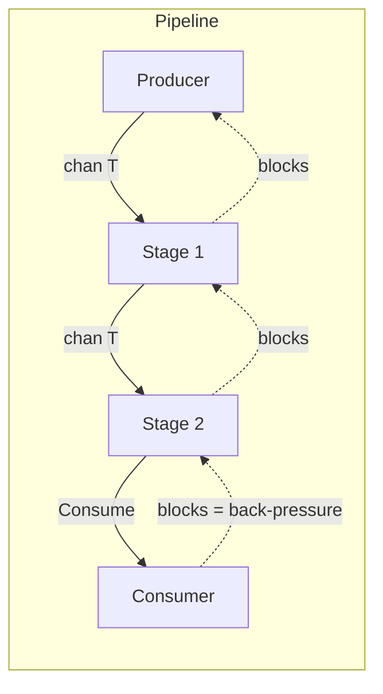

# Streaming Pipeline Interface Design

## Design Goals

- **Composability**: Stages can be chained; pipelines are first-class
- **Scalability**: Support fan-out, fan-in, bounded parallelism, and future distribution
- **Consumer-defined back-pressure**: The sink implementation chooses blocking, dropping, buffering, or throttling
- **Cancellation**: `context.Context` propagates through the pipeline
- **Go idioms**: Channels, generics (Go 1.22+), minimal interfaces

---

## Core Interfaces

### 1. Consumer (Sink) — Where Back-Pressure Is Defined

The consumer is the critical interface. **How `Consume` behaves defines back-pressure**:

```go
// Consumer is the sink of a pipeline. Implementation defines back-pressure strategy:
// - Blocking: Consume blocks until ready → back-pressure propagates upstream
// - Dropping: Consume returns immediately, discards when overloaded → no back-pressure
// - Buffered: Internal queue, blocks when full → bounded back-pressure
// - Throttled: Token bucket / rate limit → controlled throughput
type Consumer[T any] interface {
    Consume(ctx context.Context, item T) error
}
```

**Optional lifecycle** for flush/shutdown:

```go
type ConsumerWithDone[T any] interface {
    Consumer[T]
    Done(ctx context.Context) error  // Called when stream ends; consumer can flush
}
```

### 2. Producer (Source)

```go
// Producer yields items. Returns (value, true, nil) for each item, (zero, false, nil) when done,
// or (zero, false, err) on error. Caller controls pull rate → natural back-pressure.
type Producer[T any] interface {
    Next(ctx context.Context) (T, bool, error)
}
```

Alternative: channel-based `Stream(ctx) <-chan T` for push model. Pull-based `Next` gives consumer explicit control.

### 3. Stage (Transform)

A stage receives from upstream and sends downstream. Back-pressure flows via channel blocking: when the stage blocks on send, it stops receiving, so upstream blocks.

```go
// Stage transforms a stream. Run wires input to output; back-pressure propagates
// through channel semantics (blocking send → blocking receive upstream).
type Stage[T any] interface {
    Run(ctx context.Context, in <-chan T) <-chan T
}
```

For type-changing stages (e.g. `string` → `int`):

```go
type StageInOut[TIn, TOut any] interface {
    Run(ctx context.Context, in <-chan TIn) <-chan TOut
}
```

---

## Back-Pressure Strategies (Consumer Implementations)


| Strategy          | Consume behavior                            | Use case                           |
| ----------------- | ------------------------------------------- | ---------------------------------- |
| **Blocking**      | Blocks until item is processed              | Strong consistency, no drops       |
| **Buffered**      | Writes to bounded channel; blocks when full | Absorb bursts, bounded memory      |
| **Dropping**      | Returns immediately, drops if overloaded    | Best-effort, latency-sensitive     |
| **Load shedding** | Returns error when overloaded               | Fail fast, circuit breaker         |
| **Throttled**     | Waits for token/slot before accepting       | Rate-limited downstream (e.g. API) |


---

## Pipeline Composition

```go
// Pipeline connects producer → stages → consumer. Runs until completion or ctx cancel.
func Run[T any](ctx context.Context, prod Producer[T], stages []Stage[T], sink Consumer[T]) error
```

Internal flow: spawn goroutines for each stage, wire channels, and run a driver that pulls from the last stage and calls `sink.Consume`. When the consumer blocks, the whole chain blocks.

---

## Scalability Extensions

**Fan-out** (one-to-many): A stage that reads from one channel and writes to multiple consumers (or spawns multiple worker stages).

**Fan-in** (many-to-one): Merge multiple channels into one (e.g. `merge` from the Go blog).

**Bounded parallelism**: Stage with N workers; shared input channel, shared output channel. Workers block on send when downstream is slow.

**Future distribution**: The same interfaces can be implemented over RPC/queues; `Consumer` and `Producer` become network boundaries. Local implementations use channels.

---

## Architecture Diagram




---

## Suggested Package Layout

```
pipeline/
  interface.go    # Consumer, Producer, Stage interfaces
  run.go          # Run() function, driver logic
  consumer/       # Example consumer implementations
    blocking.go
    buffered.go
    dropping.go
  stage/          # Example stage implementations
    transform.go
    filter.go
```

---

## Open Design Choices

1. **Pull vs push for Producer**: `Next()` (pull) vs `Stream() <-chan T` (push). Pull gives consumer explicit control; push is more idiomatic for Go pipelines. Recommendation: support both via adapter types.
2. **Error handling**: Should `Consume` errors abort the pipeline? Recommend: yes; `Run` returns first non-nil error from any stage or consumer.
3. **Generic Stage**: Single-type `Stage[T]` vs `StageInOut[TIn, TOut]`. Both are useful; `Stage[T]` is a special case of `StageInOut[T,T]`.
4. **Done signal**: Not all consumers need `Done()`. Keep it as an optional interface (`ConsumerWithDone`) to avoid forcing empty implementations.

---

## .cursorrules Content

The `.cursorrules` file (or `.cursor/rules/*.mdc`) should document:

- Project purpose: composable streaming pipeline with consumer-defined back-pressure
- Interface-first design: prefer small interfaces, implementer chooses behavior
- Use `context.Context` in all streaming APIs
- Use generics for type-safe pipelines
- Reference this design for stage/consumer implementations

